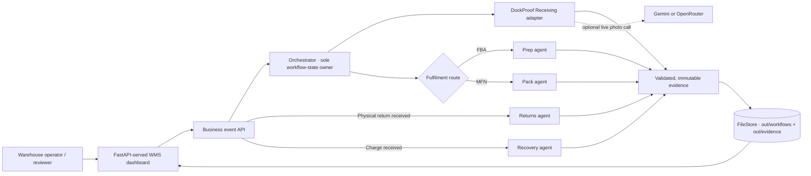

# Architecture

This document describes the **starter**. At the bottom is a section for **your Pod's architecture**, which you must fill in and which is part of the submission. A submission whose `ARCHITECTURE.md` still only describes the starter has not documented its system.

## 1. The system

```text
                POD
                 │
       ┌─────────▼─────────┐      owns workflow state; derives status and final outcome from the evidence chain
       │    Orchestrator   │      routes · validates · records evidence · retries · handles failures and UNCERTAIN
       └─────────┬─────────┘
                 │  Agent Input ▼          ▲ Agent Output (evidence)
       ┌─────────▼─────────┐
       │     Receiving     │
       └─────────┬─────────┘
                 ↓
       ┌───────────────────┐
       │       Prep        │   (FBA units)
       └─────────┬─────────┘
                 ↓
       ┌───────────────────┐
       │       Pack        │   (merchant-fulfilled / 3PL units)
       └─────────┬─────────┘
                 ↓
       ┌───────────────────┐
       │      Returns      │   (if a return happened)
       └─────────┬─────────┘
                 ↓
       ┌───────────────────┐
       │     Recovery      │   reads ALL accumulated evidence
       └─────────┬─────────┘
                 ↓
          Final Outcome        derived by the orchestrator, not copied from any agent

  shared/schemas · shared/contracts · shared/utils      data/input · data/sample · data/expected      examples/
```

The arrows show the *expected commerce journey*. Physically, every hand-off goes through the orchestrator ([`INTEGRATION-GUIDE.md`](INTEGRATION-GUIDE.md) section 1).

## 2. Responsibilities

| Component | Responsible for | Not responsible for |
|---|---|---|
| **Agent** (`agents/<stage>/`) | One stage's judgment, returned as an Agent Output with an Evidence Record. Failing open. Refusing other tenants. | Calling other agents. Setting workflow state. Rewriting earlier evidence. |
| **Orchestrator** (`orchestration/`) | Starting workflows; identifying the current stage; invoking agents with context; validating and recording evidence; updating state; routing; retries; failures; UNCERTAIN; the final outcome. | Making stage judgments. Fabricating or deleting evidence. Turning UNCERTAIN into PASS/FAIL without an explicit rule. |
| **Contract** (`shared/schemas/`) | One strict set of data shapes. | Agent-specific logic (that goes in `payload`). |
| **Stubs** (`agents/*/app.py` as shipped) | Replaying Round 2 CSV rows as valid evidence, so the plumbing can be tested. | Pretending to be agents. |

## 3. Shared data

| Object | Owner | Lives in |
|---|---|---|
| Evidence Record | the agent that produced it (immutable) | the evidence store |
| Workflow State | **the orchestrator** | the workflow store |
| Overrides | the orchestrator records them; a person makes them | Workflow State (`overrides[]`), referencing evidence |
| Final Outcome | **the orchestrator**, derived | Workflow State (`final_outcome`) |
| Captures | the Pod | `data/input/<subject>/<stage>/`, referenced by `sha256` |

## 4. Evidence flow and workflow state

```text
Agent Result → Evidence Record → Orchestrator state transition → Next stage → New evidence → Updated workflow state → Final Outcome
```

- Each stage's evidence is stored and passed to **every later stage** as `previous_evidence`.
- State is `PENDING → IN_PROGRESS → COMPLETED`, or `FAILED` / `BLOCKED` / `RECOVERY_REQUIRED` ([`ORCHESTRATION-GUIDE.md`](ORCHESTRATION-GUIDE.md) section 5), always derived from the evidence and overrides.
- `transitions[]` is the audit trail.
- A reviewer can walk from the Final Outcome to `contributing_records`, to checks, to `evidence_refs`, to the `sha256` of the exact bytes examined.

## 5. Error handling

Every failure is **recorded and never becomes success**: a degraded evidence record stands in (no checks, UNCERTAIN, the error), the stage is `error`, the workflow `FAILED` with outcome `INCOMPLETE`. Transient failures retry; refusals and invalid output do not; UNCERTAIN is preserved; `resume` retries. Full table: [`ORCHESTRATION-GUIDE.md`](ORCHESTRATION-GUIDE.md) section 8. Tenancy: `org_id` on every request, record and workflow; a record about another org is rejected as a security event; **your storage must enforce it too**.

## 6. Final outcome

`CLEAN`, `CLAIM_RECOMMENDED`, `EXCEPTION`, `NEEDS_REVIEW` or `INCOMPLETE`, with the reason, the contributing evidence, `needs_human`, and `provisional` (true unless the workflow is `COMPLETED`). Default rules: [`ORCHESTRATION-GUIDE.md`](ORCHESTRATION-GUIDE.md) section 6.

## 7. What is fixed and what is yours

**Fixed (the contract, strict):**

- The five required agents and their stages (Specialist Pods: four agents plus integration work, see [`FAQ.md`](FAQ.md))
- Common evidence requirements: the Agent Input/Output and Evidence Record shapes; PASS / FAIL / UNCERTAIN; the status vocabularies
- Required traceability: workflow id, agent id, hashes, `upstream_refs`, overrides that reference what they supersede
- An orchestrator that owns workflow state and produces a **Final Outcome**
- Minimum testing, and the submission and evaluation requirements ([`SUBMISSION-GUIDE.md`](SUBMISSION-GUIDE.md), [`ROUND3-RUBRIC.md`](ROUND3-RUBRIC.md))

**Participant-designed (the implementation, flexible):**

- Internal architecture, programming language, frameworks, how each agent is built
- How the orchestrator is implemented (the starter is one option; LangGraph, a queue, a state machine, your own)
- The communication mechanism (in-process, HTTP, queue) as long as the contract holds
- Database, persistence, deployment platform
- UI, review queue, dashboards
- Additional services, additional features
- The final-outcome policy, routing and `on_uncertain` / `on_error` policies (documented in `docs/decisions.md`)

## 8. Extension points

| You want to… | Change |
|---|---|
| Add or reroute a stage | `orchestration/flow.json` (and write a decision) |
| Change the final decision or status rules | `orchestration/rollup.py` (and its tests, and a decision) |
| Plug in a real agent | `agents/<stage>/app.py` + `agent.json` |
| Run an agent as a service in any language | `agent.json` `mode: "http"` + [`agent-api.md`](shared/contracts/agent-api.md) |
| Run your own subjects | `data/input/<subject>/<stage>/` + a cases file |
| Add agent-specific data to evidence | `payload` (never the envelope) |
| Persist to a database | implement the four store methods in `orchestration/store.py` |

## 9. Deployment options (yours)

- **Single process:** `uvicorn orchestration.api:app` with all agents `inproc`. Simplest.
- **Orchestrator + agent services:** each agent its own process, `mode: "http"`, `<STAGE>_URL` set; `GET /health` for readiness.
- Whatever you pick, the demo runs from the submitted commit and any URL works without your accounts. The API ships with **no authentication**: add it before exposing it.

---

## Your Pod's architecture  ← **replace this section**

_Delete this note and describe **your** system. At minimum:_

1. **Diagram** of your actual components and flow, including anything you added.
2. **What each agent really is**: model, rules, services, dependencies; which are still stubs.
3. **Your orchestrator**: approach, how workflow state is stored, retries, how evidence is persisted, how overrides work (link the decisions in `docs/decisions.md`).
4. **Your routing and final-outcome logic**, and how they treat uncertainty and weak evidence.
5. **Tenancy**: where it is enforced, and how you tested it.
6. **Failure model**: what you break in the demo and what happens.
7. **Deployment**: where it runs, how to reach it, how to start it.
8. **Known limits.**
# CUBE FLOW Round 3 contribution

This section describes the WMS-style shared dashboard, unit-event lifecycle, and DockProof Receiving adapter added on the `umesh` contribution branch. The original pod architecture below remains the authority for the shared agent contract and all other pod members' implementations.

## Shared operations architecture



The one-process local demo serves the frontend and APIs from `orchestration.api:app`. The static UI is in `web/`; it uses the same workflow/evidence endpoints as integrations and does not own business state. `FileStore` remains the persistence boundary, so this shape is suitable for the local demo, not a multi-instance production deployment.

## Unit lifecycle and event data flow

The dashboard posts events to `POST /events`. A first `PRODUCT_RECEIVED` event creates `WF-<org>-<unit>`, stores the PO expectation in workflow context, persists image captures under a tenant/unit-scoped `data/input/` directory, and invokes Receiving. The receiving agent returns eight checks plus expected/observed values, confidence, source references, and a sealed evidence record.

Later events update that same passport:

| Event | Orchestrator action |
| --- | --- |
| `UNIT_CREATED` | Create a PENDING unit passport without running an agent. |
| `PRODUCT_RECEIVED` | Run Receiving; run Prep/Pack only when a route is known. Also creates a passport if no earlier creation event exists. |
| `FULFILMENT_ROUTE_IDENTIFIED` | Activate Prep for FBA or Pack for MFN; the other route stays skipped. The route cannot be changed after its specialist has completed. |
| `RETURN_INITIATED` | Record the return request; no physical inspection runs. |
| `RETURN_RECEIVED` | Mark returned and activate Returns. A return-initiation alone does not activate inspection. |
| `CHARGE_RECEIVED` | Attach fee context and activate Recovery with all prior evidence. |

`event_id` values are saved to the passport so repeating the same business event is idempotent. A new route/return/charge event reopens only its previously skipped stage. Completed stages are not silently rerun, and evidence history is never removed. If required facts or photos are missing, Receiving reports `UNCERTAIN`; the event does not manufacture evidence.

## Receiving integration and model use

`agents/receiving/app.py` adapts the Round 2 DockProof eight-check policy to the Round 3 Agent Input / Output schema. `agents/receiving/vlm.py` accepts the same expected PO state and multiple receipt photos in one request. With `VLM_MODE=live`, it sends a structured prompt to Gemini or OpenRouter using server-side credentials, validates the eight verdicts and confidence values, and returns the observation for the shared evidence builder. It never falls back from a failed live call to a synthetic PASS. Without a live call, known organiser rows are explicitly labelled `synthetic-csv-fixture`; an unobserved receipt remains uncertain.

The other four agent folders are supplied pod agents and remain in-process until their respective owners replace their stubs. This contribution does not overwrite their work.

## UI direction

The dashboard follows the attached WMS reference: narrow warehouse navigation, top-level location/search controls, compact operational metrics, a passport work queue, event intake, agent health, and lifecycle activity. The UI is responsive and exposes Overview, Unit Passports, Exceptions, Agent Mesh, Evidence Ledger, Receiving, and Business Events views. It is intentionally a vanilla HTML/CSS/JS client served by FastAPI so the repo keeps a single local launch command and deployment surface.

## Deployment and security boundary

`make serve` starts the API and UI on port 8100. The current API has no authentication and the local JSON store has no cross-process locking or shared durability. Photo uploads are limited to JPEG, PNG, or WebP, capped at 8 MB each and 12 per receipt, tenant-scoped in local paths, content-hashed, and referenced relatively in evidence. Before public deployment, add authentication and authorization to every API route, durable shared workflow/evidence storage, concurrency controls, retention policy, and secure object storage for images.
